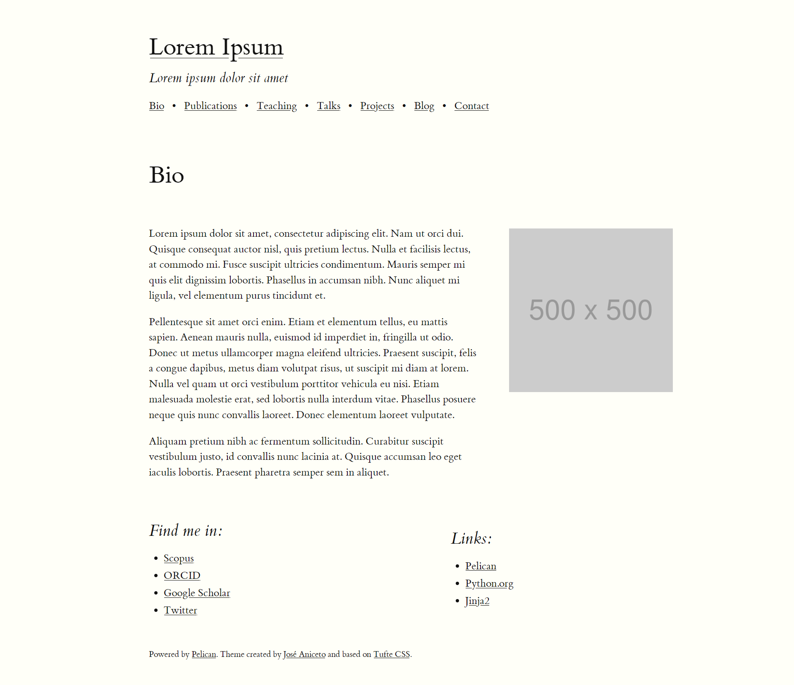

# pelican-tufte

A Pelican theme using Tufte CSS. Build with academics in mind.

## Demo 

You can see a live demo [here]().

## Contributing

Contributions are welcome.

## Acknowledgements

This theme is based on the [Tufte CSS](https://edwardtufte.github.io/tufte-css/) created by Dave Liepmann.

## License

Released under the [MIT license](LICENSE)
